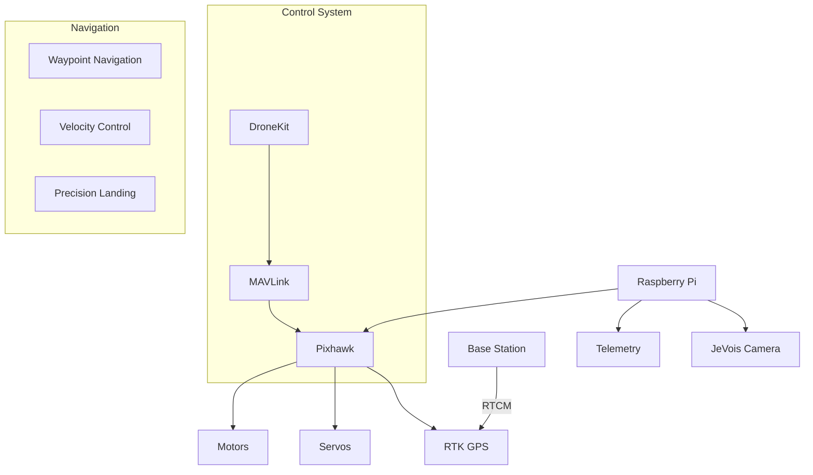
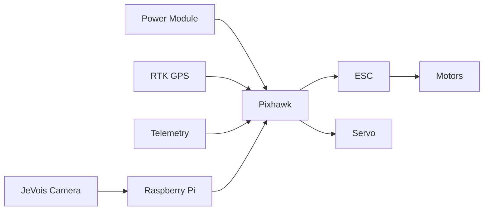
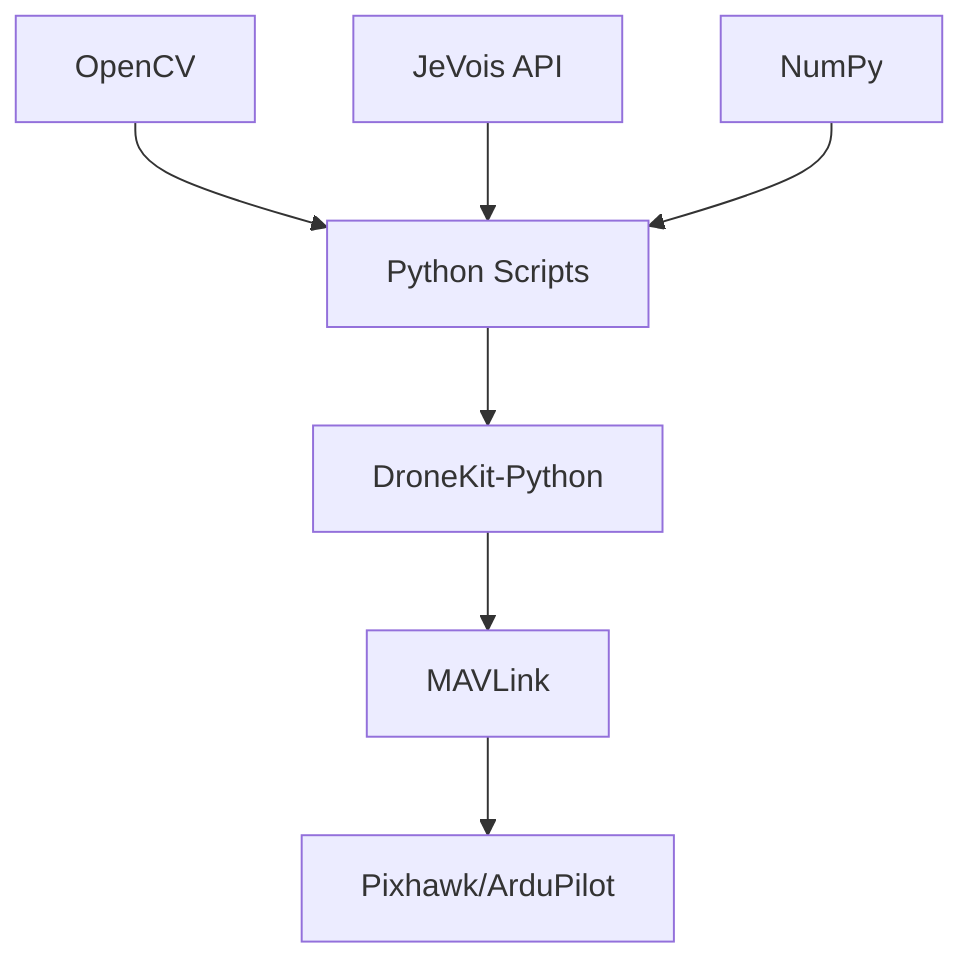
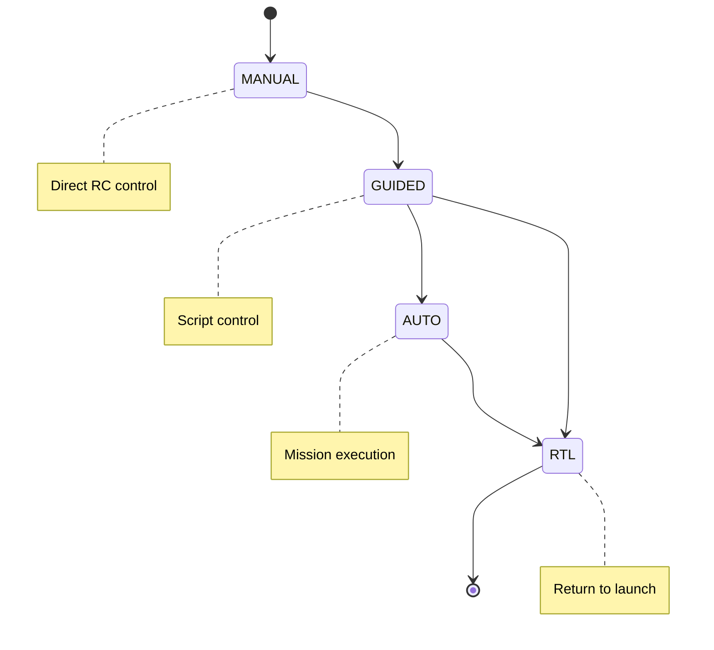

# Autonomous Rover Control System

## Overview
This project implements a comprehensive autonomous rover control system using RTK GPS for precise navigation, computer vision for precision operations, and various control modes for flexible operation. The system is built on ArduPilot and uses DroneKit-Python for autonomous control.

## Table of Contents
- [System Architecture](#system-architecture)
- [Hardware Components](#hardware-components)
- [Software Stack](#software-stack)
- [Features](#features)
- [Installation](#installation)
- [Usage](#usage)
- [Control Modes](#control-modes)
- [Code Examples](#code-examples)
- [Contributing](#contributing)
- [License](#license)

## System Architecture



## Hardware Components

### Required Components:
1. **Main Controller**
   - Raspberry Pi (3B+ or newer)
   - Pixhawk Flight Controller

2. **Navigation System**
   - RTK GPS Module
   - GPS Base Station
   - Radio Telemetry Set

3. **Motion Control**
   - Brushed ESC
   - Steering Servo
   - Drive Motors

4. **Vision System**
   - JeVois Smart Camera
   - Camera Mount

### Hardware Setup Diagram



## Software Stack

### Core Components



### Key Features:
1. **RTK GPS Navigation**
   - Centimeter-level positioning accuracy
   - Real-time RTCM corrections
   - Base station integration

2. **Autonomous Control**
   - Waypoint navigation
   - Velocity-based movement
   - Return to Launch (RTL)

3. **Vision Processing**
   - ArUco marker detection
   - Precision landing capabilities
   - Real-time position estimation

## Installation

1. **System Requirements**
```bash
# Update system
sudo apt-get update && sudo apt-get upgrade

# Install Python dependencies
pip install dronekit pymavlink numpy opencv-python
```

2. **Clone Repository**
```bash
git clone https://github.com/yourusername/autonomous-rover.git
cd autonomous-rover
```

3. **Setup RTK Base Station**
- Configure RTCM message output
- Set up radio link with rover
- Calibrate GPS position

## Usage

### Basic Operation
1. Start the base station:
```bash
# Start RTCM corrections
./start_base_station.sh
```

2. Launch the rover control script:
```python
python rover_control.py --connect /dev/ttyUSB0
```

### Control Modes



### Main Control Functions

```python
def goto_position(lat, lon, alt):
    """Navigate to specific GPS coordinates"""
    point = LocationGlobalRelative(lat, lon, alt)
    vehicle.simple_goto(point)

def set_velocity(vx, vy, vz):
    """Control velocity in local NED frame"""
    msg = vehicle.message_factory.set_position_target_local_ned_encode(...)
    vehicle.send_mavlink(msg)
```

## Code Structure

### Core Modules
1. `connection_test.py`: Vehicle connection and basic checks
2. `rover_location_based_movement.py`: GPS waypoint navigation
3. `rover_velocity_based_movement.py`: Velocity control
4. `precision_landing_jevois.py`: Vision-based landing

### Example Mission

```python
# Initialize vehicle
vehicle = connectMyCopter()
arm()

# Execute waypoint mission
waypoints = [
    LocationGlobalRelative(36.00550, -95.86124, 10),
    LocationGlobalRelative(36.00607, -95.86107, 10),
    LocationGlobalRelative(36.00604, -95.86037, 10)
]

for waypoint in waypoints:
    goto_position(waypoint)

# Return home
vehicle.mode = VehicleMode("RTL")
```

## Contributing
Contributions are welcome! Please read our contributing guidelines and submit pull requests to our repository.

## License
This project is licensed under the MIT License - see the LICENSE file for details.

## Contact
Developer: Md Khairul Islam
Institution: Hobart and William Smith Colleges
Email: khairul.islam@hws.edu
