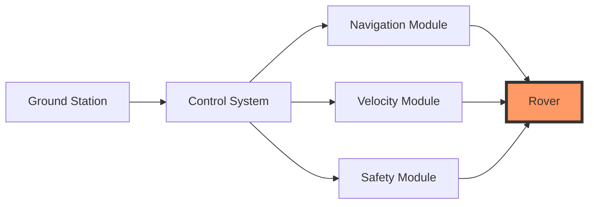
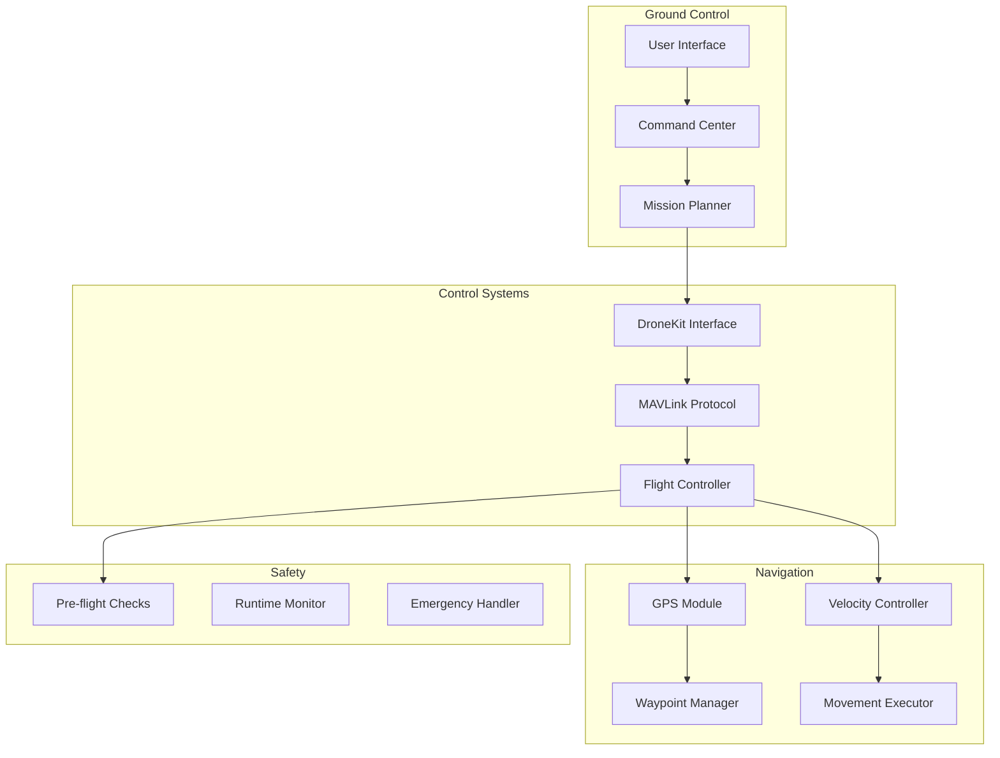
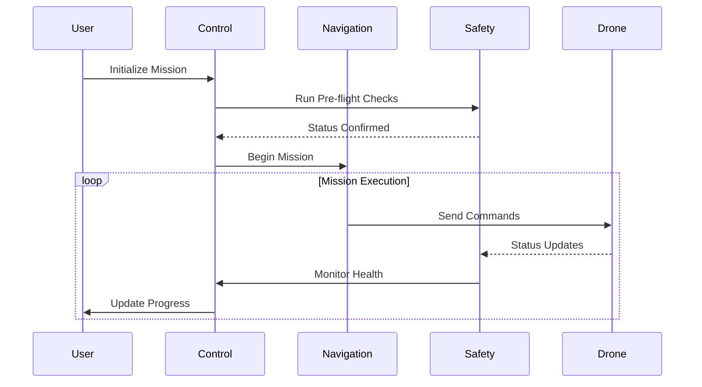
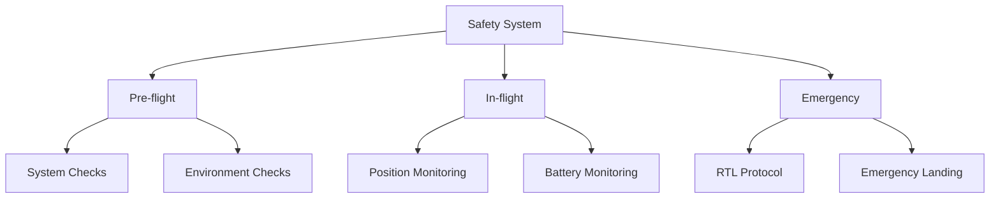
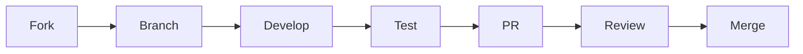

# 🚗 Smart Ground Vehicle Navigation System


[](https://www.python.org/downloads/)
[](https://dronekit-python.readthedocs.io/)
[](https://mavlink.io/en/)
[](LICENSE)
[](docs/)
[](CONTRIBUTING.md)

> A professional-grade autonomous drone control system featuring advanced waypoint navigation and precise velocity control capabilities, built on DroneKit and MAVLink protocols.

## 📑 Table of Contents
- [Key Features](#-key-features)
- [System Architecture](#-system-architecture)
- [Quick Start](#-quick-start)
- [Detailed Documentation](#-detailed-documentation)
- [Control Modes](#-control-modes)
- [Safety Systems](#-safety-systems)
- [Performance Metrics](#-performance-metrics)
- [Configuration Guide](#-configuration-guide)
- [Contributing](#-contributing)
- [Support & Community](#-support--community)

## 🌟 Key Features

### Core Capabilities
- **Precision Waypoint Navigation**
  - GPS-guided autonomous flight
  - Dynamic waypoint adjustment
  - Altitude hold capability
  - Return-to-Launch (RTL) functionality

- **Advanced Velocity Control**
  - Local NED frame control
  - Global NED frame control
  - Precise movement patterns
  - Velocity-based maneuvering

- **Intelligent Safety Systems**
  - Pre-flight diagnostics
  - Real-time monitoring
  - Failsafe mechanisms
  - Emergency protocols



## 🏗 System Architecture

### Comprehensive System Overview


### Data Flow Architecture


## 🚀 Quick Start

### 1. System Requirements
```bash
# Hardware Requirements
- Drone with Pixhawk/APM flight controller
- GPS module
- Telemetry radio
- Ground control station

# Software Requirements
- Python 3.7+
- DroneKit 2.9.2+
- MAVLink 2.0
```

### 2. Installation
```bash
# Clone repository
git clone https://github.com/yourusername/advanced-drone-control.git
cd advanced-drone-control

# Create virtual environment
python -m venv venv
source venv/bin/activate  # Linux/Mac
.\venv\Scripts\activate   # Windows

# Install dependencies
pip install -r requirements.txt
```

### 3. Basic Usage
```python
# Waypoint Navigation Example
python AutonomousDroneNavigator.py --connect 127.0.0.1:14550

# Velocity Control Example
python AutonomousDroneVelocity.py --connect 127.0.0.1:14550
```

## 📚 Detailed Documentation

### Control System Components
```python
# Core Components Structure
├── Navigation/
│   ├── waypoint_manager.py
│   ├── position_estimator.py
│   └── path_planner.py
├── Control/
│   ├── velocity_controller.py
│   ├── attitude_controller.py
│   └── movement_executor.py
├── Safety/
│   ├── preflight_checks.py
│   ├── monitoring.py
│   └── emergency_handler.py
└── Utils/
    ├── connection_manager.py
    └── data_logger.py
```

### Key Code Examples

#### Waypoint Navigation
```python
def navigate_to_waypoint(latitude, longitude, altitude):
    """
    Navigate to specified waypoint with position validation
    
    Args:
        latitude (float): Target latitude
        longitude (float): Target longitude
        altitude (float): Target altitude in meters
        
    Returns:
        bool: Success status
    """
    target = LocationGlobalRelative(latitude, longitude, altitude)
    vehicle.simple_goto(target)
    
    return monitor_navigation_progress(target)
```

#### Velocity Control
```python
def set_velocity_ned(velocity_north, velocity_east, velocity_down):
    """
    Set velocity using NED coordinate frame
    
    Args:
        velocity_north (float): Velocity in North direction (m/s)
        velocity_east (float): Velocity in East direction (m/s)
        velocity_down (float): Velocity in Down direction (m/s)
    """
    msg = vehicle.message_factory.set_position_target_local_ned_encode(
        0,0,0,mavutil.mavlink.MAV_FRAME_LOCAL_NED,
        0b0000111111000111,
        0,0,0,velocity_north, velocity_east, velocity_down,
        0,0,0,0,0)
    vehicle.send_mavlink(msg)
```

## 🎮 Control Modes

### Available Flight Modes
| Mode | Description | Use Case | Safety Level |
|------|-------------|----------|--------------|
| GUIDED | Autonomous navigation | Waypoint missions | High |
| VELOCITY | Direct velocity control | Precise movements | Medium |
| RTL | Return to launch | Emergency return | Very High |
| MANUAL | Direct pilot control | Emergency override | Medium |

## 🛡 Safety Systems

### Multi-Layer Safety Architecture


## 📊 Performance Metrics

### Navigation Accuracy
| Metric | Performance | Conditions |
|--------|-------------|------------|
| Position Hold | ±1.5m | Good GPS |
| Waypoint Accuracy | ±2m | Clear sky |
| Velocity Control | ±0.1 m/s | Stable conditions |

### System Response Times
| Operation | Response Time | Notes |
|-----------|--------------|-------|
| Command Processing | <100ms | Direct commands |
| Emergency Stop | <500ms | All conditions |
| Mode Switch | <200ms | All modes |

## ⚙️ Configuration Guide

### Key Parameters
```python
# config.py
NAVIGATION_SETTINGS = {
    'DEFAULT_ALTITUDE': 10,  # meters
    'WAYPOINT_ACCEPTANCE_RADIUS': 1,  # meters
    'MAX_GROUNDSPEED': 15,  # m/s
    'RTL_ALTITUDE': 20,  # meters
}

SAFETY_SETTINGS = {
    'MIN_BATTERY': 20,  # percentage
    'MAX_DISTANCE': 1000,  # meters
    'FAILSAFE_TIMEOUT': 5,  # seconds
}
```

## 🤝 Contributing

We welcome contributions! See our [Contributing Guide](CONTRIBUTING.md) for details.

### Development Flow


## 🌐 Support & Community

- 📫 [Report Issues](https://github.com/yourusername/advanced-drone-control/issues)
- 💬 [Join Discussion](https://github.com/yourusername/advanced-drone-control/discussions)
- 📱 [Discord Community](https://discord.gg/yourdronecommunity)

## 📈 Future Roadmap

### Planned Features
- [ ] Advanced obstacle avoidance
- [ ] Machine learning integration
- [ ] Swarm control capabilities
- [ ] Enhanced mission planning
- [ ] Weather-aware navigation
- [ ] Advanced failsafe mechanisms

## 📜 License

Copyright © 2024 [Your Name]

This project is licensed under the MIT License - see the [LICENSE](LICENSE) file for details.

## 🙏 Acknowledgments

- DroneKit Development Team
- ArduPilot Community
- MAVLink Protocol Developers
- Open Source Contributors

---

<div align="center">
    
**Made with ❤️ by [Your Name]**

[Website](https://yourwebsite.com) · [Twitter](https://twitter.com/yourusername) · [LinkedIn](https://linkedin.com/in/yourusername)

</div>
